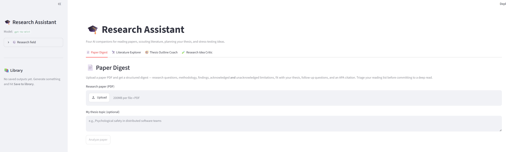
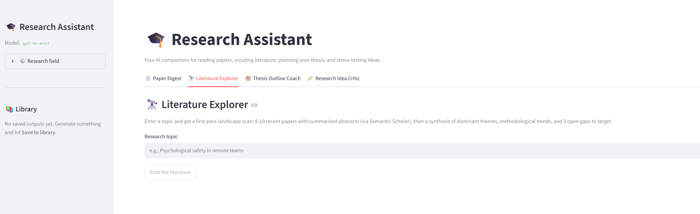

# 🎓 Research Assistant

A multi-tab Streamlit app that gives a researcher four AI companions for the
most common parts of the research lifecycle — **reading papers, scouting
literature, planning a thesis, and stress-testing ideas** — all sharing one LLM
client, one `.env`, and one local library.

Built with Streamlit · LangChain · OpenAI (`gpt-4o-mini`) · Pydantic.

📄 See [`DESIGN.md`](DESIGN.md) for the full design write-up (problem, architecture, and design choices).

## The four tabs

| Tab | What it does |
|---|---|
| **📄 Paper Digest** | Upload a paper PDF (+ optional thesis topic) → structured digest: TL;DR, research questions, methodology, findings, theoretical contributions, acknowledged **and** unacknowledged limitations, thesis fit, follow-up questions, APA citation. |
| **🔭 Literature Explorer** | Enter a topic → 8–10 recent papers (title, authors, year, summarized abstract) from Semantic Scholar, plus a synthesis: dominant themes, methodological trends, 3 open gaps. |
| **🧭 Thesis Outline Coach** | Topic + field + methodology + timeline → chapter-by-chapter outline, per-chapter research questions, suggested methods, milestone timeline, seed citations. |
| **🧪 Research Idea Critic** | Paste an idea/abstract → novelty score (1–10) with reasoning, related work, methodological concerns, suggested improvements, sharpening questions. |

Every tab's output can be **saved to a shared local library** (browsable in the
sidebar). System prompts are tuned for management/business research by default,
with a sidebar **Field** switch (Management / STEM / Social Sciences / Other).

## Screenshots

**📄 Paper Digest** — upload a PDF and triage it before a deep read:



**🔭 Literature Explorer** — first-pass landscape scan of a topic via Semantic Scholar:



## Setup

This project uses [UV](https://docs.astral.sh/uv/).

```powershell
# 1. Install dependencies into a local .venv (UV reads pyproject.toml)
uv sync

# 2. Add your OpenAI key
copy .env.example .env
#   then edit .env and set OPENAI_API_KEY=sk-...

# 3. Run the app
uv run streamlit run app.py
```

The app opens at http://localhost:8501.

> **Note:** `uv` may be installed but not on your PATH. If `uv` isn't found,
> use the full path (e.g. `C:\Users\<you>\.local\bin\uv.exe`) or add that
> folder to PATH.

## Configuration

| Variable | Required | Purpose |
|---|---|---|
| `OPENAI_API_KEY` | ✅ | LLM calls (all tabs). |
| `SEMANTIC_SCHOLAR_API_KEY` | optional | Raises Tab 2 rate limits. The keyless public tier works too. |

Change the model in one place: `MODEL_NAME` in `utils.py`.

## Tech stack

| Layer | Choice |
|---|---|
| UI | Streamlit (multi-tab via `st.tabs`) |
| LLM | OpenAI `gpt-4o-mini` via LangChain |
| Structured output | Pydantic models (one per tab) |
| PDF parsing | pypdf |
| Literature search | Semantic Scholar Graph API |
| Storage | Local JSON file |
| Packaging | UV (`pyproject.toml` + `uv.lock`) |

## Project structure

```
app.py            # Streamlit entry: tabs + sidebar (field + library)
tabs/
  paper_digest.py # Tab 1
  lit_explorer.py # Tab 2
  thesis_coach.py # Tab 3
  idea_critic.py  # Tab 4
prompts.py        # All system prompts (field-tuned)
schemas.py        # All Pydantic output models
utils.py          # LLM factory, PDF parsing, library save/load
data/library.json # Saved outputs across all tabs
```

## How it works

Each tab shares the same skeleton — only the **input**, the **system prompt**
(`prompts.py`), and the **output schema** (`schemas.py`) differ. A tab collects
input, calls the shared LLM client with a Pydantic schema for reliable
structured output, renders the result as clean markdown, and offers a one-click
**Save to library**. Literature Explorer adds a real Semantic Scholar lookup so
the LLM summarizes *actual* papers rather than inventing references.

## What's next

- **Multi-paper Q&A across the library** (RAG)
- **Automatic literature cross-referencing** between saved entries
- **Scheduled arXiv / Semantic Scholar imports** on a topic watchlist
- **Full-text PDF retrieval** for papers found in the Literature Explorer
